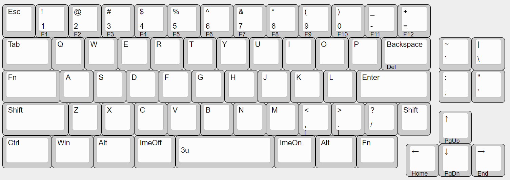

# PinKey

A condensed 60% hot swappable custom mechanical keyboard powered by RP2040-Zero.

## Default Layout

You can customize the layout with [Vial](https://get.vial.today/) configurator.

Spacebar can be swap 3u to 2.25/2.75u with 2u stabilizers if you don't have 3u spacebar and its stabilizers.

## Build Guide

See [doc/buildguide.md](doc/buildguide.md)

## LICENSE

This project is licensed under the MIT License, see the [LICENSE file](LICENSE) for details.
